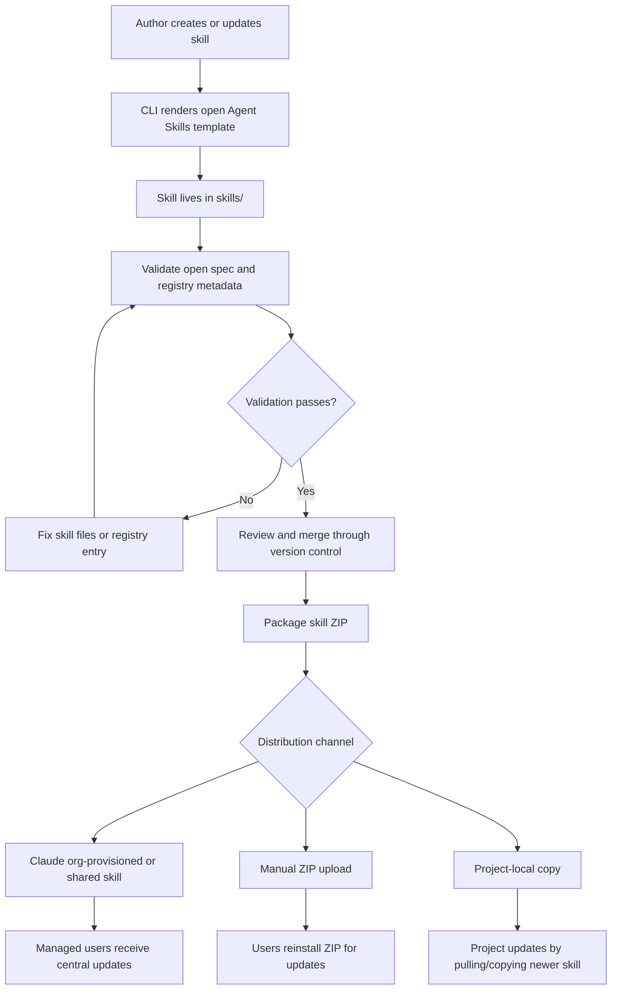

# Travel Agent Skills

A central, version-controlled repository for creating, maintaining, validating, releasing, and consuming reusable travel agent skills using the open Agent Skills format.

## What are Agent Skills?
Agent Skills are a lightweight, open format for extending AI agent capabilities with specialized knowledge and workflows.  

At its core, a skill is a folder containing a SKILL.md file. This file includes metadata (name and description, at minimum) and instructions that tell an agent how to perform a specific task. Skills can also bundle scripts, reference materials, templates, and other resources.

- Domain expertise: Capture specialized knowledge — from legal review processes to data analysis pipelines to presentation formatting — as reusable instructions and resources.
- Repeatable workflows: Turn multi-step tasks into consistent, auditable procedures.
- Cross-product reuse: Build a skill once and use it across any skills-compatible agent.
​


## Skill Directory Structure

```
my-skill/
├── SKILL.md          # Required: metadata + instructions
├── scripts/          # Optional: executable code
├── references/       # Optional: documentation
├── assets/           # Optional: templates, resources
└── ...               # Any additional files or directories
```

## Agent Skills Specification Reference

This project should follow the open Agent Skills specification at [agentskills.io/specification](https://agentskills.io/specification). Keep this section as a quick implementation reference for templates, validation, and release packaging.

### Required `SKILL.md` Format

Every skill must be a directory containing a `SKILL.md` file. The `SKILL.md` file must contain YAML frontmatter followed by Markdown instructions.

Minimal valid skill:

```yaml
---
name: flight-search
description: Search, compare, and summarize flight options. Use when users ask for airfare, routes, flight availability, airline comparisons, layovers, cabin classes, or baggage-aware flight recommendations.
---

# Flight Search

Follow the workflow instructions here.
```

### Frontmatter Fields

| Field | Required | Constraints |
|---|---:|---|
| `name` | Yes | 1-64 characters. Lowercase letters, numbers, and hyphens only. Must not start or end with a hyphen. Must not contain consecutive hyphens. Must match the parent directory name. |
| `description` | Yes | 1-1024 characters. Must describe what the skill does and when to use it. Include specific keywords that help agents identify relevant tasks. |
| `license` | No | Short license name or reference to a bundled license file. |
| `compatibility` | No | 1-500 characters if provided. Use only for specific environment requirements such as intended product, system packages, network access, or runtime needs. |
| `metadata` | No | Additional key-value metadata. Keep values simple and string-like for maximum compatibility. Put richer project governance data in `registry.yaml` or release manifests. |
| `allowed-tools` | No | Experimental. Space-separated string of pre-approved tools. Support varies by agent implementation. |

### Naming Rules

Valid names:

```yaml
name: flight-search
name: hotel-search
name: itinerary-planning
```

Invalid names:

```yaml
name: Flight-Search     # uppercase not allowed
name: -flight-search    # cannot start with hyphen
name: flight-search-    # cannot end with hyphen
name: flight--search    # consecutive hyphens not allowed
```

### Description Rules

Descriptions are the primary discovery signal agents see before loading the full skill. A good description should include:

- What the skill does.
- When the skill should be used.
- Specific task, file type, domain, or workflow keywords.

Good:

```yaml
description: Search, compare, and summarize flight options using approved flight data sources. Use when users ask for airfare, routes, flight availability, airline comparisons, layovers, cabin classes, baggage-aware options, or travel flight recommendations.
```

Poor:

```yaml
description: Helps with flights.
```

### Body Content

The Markdown body after the frontmatter contains the skill instructions. There are no strict format restrictions, but useful sections include:

- Step-by-step workflow instructions.
- Required inputs.
- Output format.
- Examples of inputs and outputs.
- Common edge cases and quality checks.

Keep `SKILL.md` focused. The full body is loaded when the skill activates, so long instructions should move into referenced files.

This project currently uses a local template variable named `{{ title }}` to generate a readable Markdown heading from the skill name, for example `flight-search` becomes `# Flight Search`. This is only a template convenience for readability. It is not an Agent Skills specification field and can be changed or removed later.

### Optional Directories

- `scripts/`: Executable code agents can run. Scripts should be self-contained, document dependencies, provide helpful errors, and handle edge cases.
- `references/`: Additional documentation agents can read on demand. Keep files focused and avoid dumping everything into one large file.
- `assets/`: Static resources such as templates, images, lookup tables, schemas, or example files.

### Progressive Disclosure Guidelines

Agent Skills are loaded progressively:

1. Metadata: `name` and `description` are loaded for discovery.
2. Instructions: the full `SKILL.md` body is loaded when the skill is activated.
3. Resources: files in `scripts/`, `references/`, and `assets/` are loaded or used only when needed.

Keep the main `SKILL.md` under 500 lines. Move detailed reference material to separate files.

### File References

Reference files using relative paths from the skill root:

```markdown
See [the result format](references/result-format.md).

Run the normalization script:
scripts/normalize_airports.py
```

Keep references one level deep from `SKILL.md` and avoid deeply nested reference chains.

### Validation

Use the reference validator where possible:

```bash
skills-ref validate ./skills/flight-search
```

Our CLI should eventually wrap or call this validation as part of:

```bash
skills validate skills/flight-search
skills validate --all
```

### Project Metadata Policy

The open spec allows optional `metadata`, and real-world skills may use it for portable skill-local details such as version, author, license, or runtime requirements. This project should keep `SKILL.md` metadata focused on details that should travel with the packaged skill.

Good `SKILL.md` metadata examples:

- Skill version.
- Author or owning organization.
- License.
- Runtime requirements, such as required binaries or install hints.

Repository governance data should live in `registry.yaml`, release manifests, or lock files instead of depending on `SKILL.md` frontmatter.

Examples of governance data that belongs outside `SKILL.md`:

- Review status.
- Distribution channels.
- Update behavior.
- Release artifacts.
- Checksums.
- Downstream project pins.

## How do Agent Skills work?

Agents load skills through progressive disclosure, in three stages:

1. **Discovery**: At startup, agents load only the name and description of each available skill, just enough to know when it might be relevant.
2. **Activation**: When a task matches a skill's description, the agent reads the full SKILL.md instructions into context.
3. **Execution**: The agent follows the instructions, optionally executing bundled code or loading referenced files as needed.

Full instructions load only when a task calls for them, so agents can keep many skills on hand with only a small context footprint.

## Overview

This project is intended to be the source of truth for skills shared across many teams and projects. Teams should be able to author skills here, review them through version control, validate them in CI, release stable versions, and consume approved skill versions from downstream agent projects.

Skill update behavior depends on the consumption channel. Organization-provisioned or shared workspace skills can be centrally updated for managed users. Skills distributed as ZIP files and uploaded by individual users are independent private copies, so consumers must reinstall or replace the ZIP to receive updates. This project must support both models explicitly.

When building this project, prefer mature open-source libraries over custom infrastructure. The current planned stack is:

- **Typer** for the CLI.
- **Rich** for terminal output.
- **Pydantic** for structured config and metadata models.
- **Jinja2** for skill template rendering.
- **PyYAML** or **ruamel.yaml** for YAML/frontmatter handling.
- **pytest** for automated tests.
- **skills-ref / agentskills** for open Agent Skills validation where possible.

## Target Repository Structure

```
travel-agent-skills/
├── skills/                     # Shared, version-controlled skills
│   └── flight-search/
│       ├── SKILL.md
│       ├── references/         # Optional: on-demand documentation
│       ├── scripts/            # Optional: executable helper code
│       └── assets/             # Optional: templates, schemas, and static files
├── templates/                  # Templates used by the CLI
│   └── basic-skill/
│       └── SKILL.md.j2
├── src/
│   └── travel_agent_skills/    # CLI and project logic
│       ├── commands/
│       │   ├── create.py
│       │   ├── delete.py
│       │   ├── inspect.py
│       │   ├── package.py
│       │   └── validate.py
│       ├── cli.py
│       ├── packaging.py
│       ├── registry.py
│       ├── standards.py
│       └── validation.py
├── tests/
├── docs/
│   └── skill-standards.md
├── registry.yaml               # Skill index, owners, versions, and status
├── releases/                   # Future: packaged skill ZIPs and release metadata
├── pyproject.toml
└── README.md
```

## End-To-End Process



## Usage

Install the CLI in a virtual environment:

```bash
python3 -m venv .venv
source .venv/bin/activate
pip install -e ".[dev]"
```

### Create a skill

```bash
# Minimal — creates skills/hotel-search/SKILL.md and a registry.yaml entry
skills create hotel-search --owner travel-platform

# With optional folders selected non-interactively
skills create hotel-search --owner travel-platform --with-references --with-assets

# Interactive — prompts for each optional folder with a short description
skills create hotel-search --owner travel-platform --interactive

# With a custom status and tags
skills create hotel-search --owner travel-platform --status active --tag hotel --tag accommodation
```

### Validate a skill

```bash
# Validate one skill
skills validate skills/flight-search

# Validate every skill in skills/
skills validate --all
```

### List and inspect skills

```bash
# List all registered skills
skills list

# Show full metadata for one skill
skills info flight-search
```

### Package a skill for Claude

```bash
# Creates releases/flight-search/0.1.0/flight-search.zip and release.yaml
skills package flight-search
```

### Delete a skill

```bash
# Prompts for confirmation, then removes the skill directory and registry entry
skills delete flight-search

# Skip the confirmation prompt (for CI or scripted use)
skills delete flight-search --yes
```

## Claude Distribution

Skills can be distributed to Claude agents in two ways. Choose the right model for each consuming project.

### Org-provisioned or shared workspace skills

Skills are centrally managed and pushed to all users in an organization or shared workspace. When the skill is updated in this repository and republished, managed users receive the update automatically without any action on their part.

Use this model for:
- Skills that must stay in sync across all agents and users.
- Skills owned and governed by a platform or ops team.
- Environments where individual users should not manage their own skill versions.

### Manual ZIP upload

A skill ZIP is downloaded from `releases/` and uploaded directly to Claude by an individual user. The uploaded ZIP is a private, independent copy. It does not receive updates automatically.

**Important:** when the skill is updated and repackaged in this repository, consumers who installed via ZIP must download the new ZIP and reinstall it manually to receive the update.

Use this model for:
- Individual users or teams managing their own Claude setup.
- Environments where centralized provisioning is not available.
- Testing a specific skill version without affecting other users.

### Project-local copy

A skill folder is copied directly into another repository or project. Updates require manually pulling or copying the newer skill version from this repository.

---

## Generate a skill with LLM drafting

```bash
# Draft a full SKILL.md body via Claude Haiku. Requires ANTHROPIC_API_KEY.
skills generate disruption-handling \
  --description "Handle flight disruptions, rebooking on cancelled or delayed flights, and compensation claims." \
  --owner travel-platform

# Use a different model (OpenRouter model string)
skills generate disruption-handling \
  --description "..." \
  --owner travel-platform \
  --model google/gemini-2.5-pro

# Overwrite an existing draft
skills generate disruption-handling --description "..." --owner travel-platform --force
```

The generated skill is always `status: draft`. Review `SKILL.md`, edit as needed, then open a PR — the eval gate runs automatically.

---

## CI / CD Setup

### GitHub Secrets

Secrets are configured **per repo**, not in your GitHub profile. For each repo:

```
github.com/Tabhi-Commons/travel-agent-skills
  → Settings → Secrets and variables → Actions → New repository secret

github.com/Tabhi-Commons/skill-testing-playground
  → Settings → Secrets and variables → Actions → New repository secret
```

**Add to both repos:**

| Secret | Value |
|---|---|
| `LANGFUSE_PUBLIC_KEY` | `pk-lf-...` |
| `LANGFUSE_SECRET_KEY` | `sk-lf-...` |
| `LANGFUSE_HOST` | `https://cloud.langfuse.com` |
| `OPENROUTER_API_KEY` | `sk-or-...` |

**Add only to `travel-agent-skills`:**

| Secret | Value |
|---|---|
| `EVAL_PLATFORM_TOKEN` | GitHub PAT with `repo:read` scope on `skill-testing-playground` |

### Local `.env`

```bash
# skill-testing-playground/.env and travel-agent-skills/.env
ANTHROPIC_API_KEY=sk-ant-...
OPENROUTER_API_KEY=sk-or-...
LANGFUSE_PUBLIC_KEY=pk-lf-...
LANGFUSE_SECRET_KEY=sk-lf-...
LANGFUSE_HOST=https://cloud.langfuse.com
```

---

## Current Implementation Status

The CLI is fully functional end to end. All commands are implemented, tested, and validated against the open Agent Skills specification.

**Commands available:**

| Command | Description |
|---|---|
| `skills create <name>` | Scaffold a new skill from the template, with optional resource folders and registry entry |
| `skills validate <path>` | Validate one skill against the spec and registry rules |
| `skills validate --all` | Validate every skill in `skills/` |
| `skills list` | List all registered skills from `registry.yaml` |
| `skills info <name>` | Show full registry metadata for one skill |
| `skills package <name>` | Package a skill into a Claude-compatible ZIP with release metadata |
| `skills delete <name>` | Remove a skill directory and its registry entry |

**Test coverage:** 51 tests, 92% line coverage across all modules.

**Example skill:** `skills/flight-search` is fully authored, validated, and packaged as a reference implementation.

**Known gaps:**

- This folder is not currently initialized as a Git repository.
- CI workflow not yet added (Phase 8 in progress).
- `skills-ref` / `agentskills` open spec validator not yet integrated (optional deeper validation).

## Implementation TODOs

### Phase 1: Foundation

- [x] Create Python package skeleton with `pyproject.toml`.
- [x] Add Typer-based CLI entrypoint.
- [x] Add initial dependencies for Typer, Rich, Pydantic, Jinja2, YAML parsing, pytest, and skills validation.
- [x] Add initial test structure.
- [x] Add root `registry.yaml` for skill discovery and ownership metadata.

### Phase 2: Skill Template And Standards

- [x] Define skill naming convention.
- [x] Create `templates/basic-skill` using the open Agent Skills format.
- [x] Add `templates/basic-skill/SKILL.md.j2`.
- [x] Add Agent Skills specification reference to this README.
- [x] Keep generated `SKILL.md` frontmatter focused: `name`, `description`, and portable skill-local metadata only.
- [x] Keep project governance metadata in `registry.yaml`: version, owners, status, tags, and distribution notes.
- [x] Define template support for optional Agent Skills folders: `scripts/`, `references/`, and `assets/`.
- [x] Add template placeholders or `.gitkeep` files for selected optional folders when they are created.
- [x] Update `docs/skill-standards.md` to match this simplified split.

### Phase 3: Create Command

- [x] Implement `skills create <name>`.
- [x] Render skill templates using Jinja2.
- [x] Prevent overwriting an existing skill unless explicitly forced.
- [x] Add tests for skill creation.
- [x] Support `--owner`, `--status`, and `--tag` options by writing to `registry.yaml`.
- [x] Support optional resource folder selection during creation.
- [x] Add non-interactive folder flags: `--with-scripts`, `--with-references`, `--with-assets`, and `--with-all`.
- [x] Add an interactive checklist for optional folders when running `skills create` in an interactive terminal.
- [x] Show short guidance for each optional folder during creation:
  - `scripts/`: executable code agents can run.
  - `references/`: documentation agents can load on demand.
  - `assets/`: static templates, images, schemas, or lookup files.
- [x] Add tests for registry updates during skill creation.
- [x] Add tests for optional folder creation.

### Phase 4: Validate Command

- [x] Implement `skills validate <path>`.
- [x] Implement `skills validate --all`.
- [x] Validate `SKILL.md` frontmatter.
- [x] Validate folder name matches the skill name.
- [x] Validate registry metadata for skills in `skills/`.
- [x] Validate referenced files exist.
- [ ] Integrate `skills-ref` / `agentskills` validation where possible.
- [x] Add tests for valid and invalid skills.

### Phase 5: List And Inspect

- [x] Implement `skills list`.
- [x] Implement `skills info <name>`.
- [x] Show name, version, owners, status, tags, and path from `registry.yaml`.
- [x] Add tests for registry loading and list/info commands.

### Phase 6: Package For Claude

- [x] Implement `skills package <name>`.
- [x] Generate a Claude-compatible ZIP with the skill folder at the ZIP root.
- [x] Add a small `release.yaml` beside the ZIP with version, checksum, owners, and date.
- [x] Add package tests that inspect ZIP structure.

### Phase 7: Example Skill

- [x] Create `skills/flight-search` as the first example skill.
- [x] Add flight-search workflow instructions.
- [x] Add standard flight result format reference.
- [x] Validate the example skill through the CLI.
- [x] Package the example skill for Claude.

### Phase 8: Minimal Documentation And CI

- [x] Add short README usage examples for create, validate, list, info, and package.
- [x] Document Claude distribution options: org-provisioned/shared skills versus manual ZIP upload.
- [x] Document that manually uploaded ZIP skills require reinstalling to receive updates.
- [ ] Add CI workflow to run validation and tests.

## Later Ideas

These are useful, but not part of the MVP:

- `skills search <query>`.
- `skills install <name> --target <path>`.
- `skills release <name> --version <version>`.
- Skill-scoped Git tag automation, for example `flight-search/v1.2.0`.
- Changelog generation.
- `skills outdated`, `skills upgrade`, and `skills sync`.
- Consumer lock files such as `skills.lock.yaml`.
- ChatGPT/GPT export.
- OpenAPI action export.
